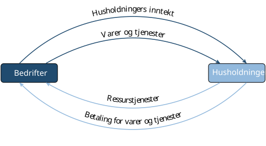
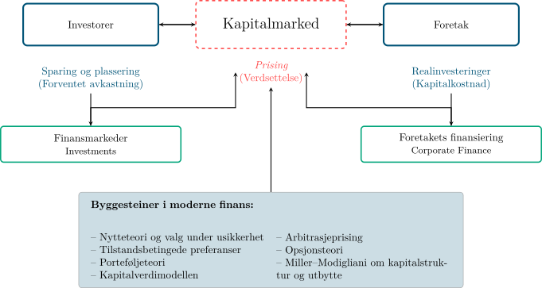
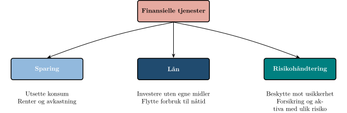
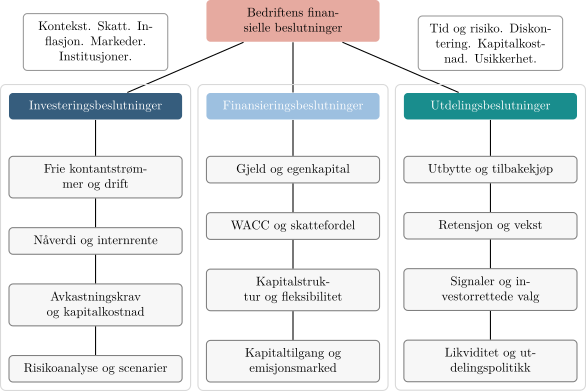

Økonomi handler om et enkelt, men evig problem: vi ønsker oss alltid mer enn
vi kan få. Gapet mellom hva vi vil ha og hva vi faktisk kan skaffe er selve
motoren i økonomifaget.

BED3 tar utgangspunkt i dette problemet og handler om hvordan vi organiserer
de knappe ressursene bedrifter trekker på i sin daglige drift, hovedsakelig
kapital. I
investeringsanalysen ser vi på hvordan prosjekter må prioriteres når
kapitalen ikke strekker til alt. I porteføljeteorien ser vi på hvordan
kapitalen kan fordeles mellom aktiva for å balansere risiko og avkastning. I
kapitalverdimodellen ser vi hvordan markedet priser risikokapital, og i
kapitalstruktur analyserer vi hvordan bedrifter bør hente inn kapital gjennom
gjeld eller egenkapital.

Kurset tar oss også videre inn i nærliggende temaer som gir et bredere bilde
av hvordan kapital organiseres i en moderne økonomi. Vi ser på hvordan
bærekraft og etiske hensyn påvirker investeringsbeslutninger, og introduserer
opsjoner og terminkontrakter som verktøy for fleksibilitet og risikostyring.
Vi undersøker også hvordan rentemarkedet for gjeldskapital fungerer og
hvordan valutamarkedene setter rammer for investeringer og finansiering i en
global sammenheng. Slik spenner BED3 over
flere dimensjoner av det samme problemet: hvordan den knappe ressursen
kapital kan brukes og prises på en måte som skaper mest mulig verdi gitt de
ønsker og rammer samfunnet står overfor.

## Opphavet og omfanget av økonomi

### Hva er økonomi?

Et spørsmål det er naturlig å kunne svare på etter flere år med
økonomistudier er: hva er økonomi? En foreløpig definisjon er at *økonomi
er studiet av hvordan mennesker bruker ressurser til å tilfredsstille sine
ønsker*. Ordet ønsker krever presisering. Vi ønsker alle mat, klær og et tak
over hodet for å leve, men de fleste ønsker seg langt mer. Vi ønsker oss
biler, større hus og feriereiser. Vår evne til å ønske er nesten uendelig,
men ressursene i verden er begrensede. Med andre ord har vi knapphet på
ressurser: behovene er større enn tilgangen. Dermed oppstår et gap mellom hva
vi ønsker og hva vi faktisk kan få tak i. Å redusere dette gapet er den
grunnleggende problemstillingen som studeres i økonomi. Knapphet tvinger oss
til å velge, og økonomi er studiet av hvordan vi bør ta slike valg slik at vi
ikke sløser med ressurser.

Det finnes to måter å minske avstanden mellom det vi ønsker oss og det vi
kan få tak i: vi kan redusere ønskene våre, eller vi kan skaffe mer. Poeter, filosofer og religiøse tenkere har ofte anbefalt
den første veien. Historien viser oss derimot at vi stort sett har valgt den
andre, med varierende og ofte vanskelig målbar suksess. Som økonomer tar vi
ikke stilling til hvilken vei som er best, men fagfeltet vårt er avgrenset
til å studere den andre veien.

Men hva er det egentlig vi ønsker oss mer av, og hva faller innenfor
økonomiens domene?

### Mer av hva

Økonomifaget retter særlig oppmerksomheten mot hvordan vi kan skaffe mer av
goder (en samlebetegnelse på varer og tjenester) som både tilfredsstiller
ønsker og kan omsettes i et marked. Slike nyttige og knappe goder kalles
*økonomiske goder*. Alle andre goder omtales som *ikke-økonomiske goder*.

Det finnes mange goder som ikke kan omsettes, som atletiske evner, venners
gunst eller familiens kjærlighet. Disse kan være vel så viktige som
økonomiske goder, men mennesker ser ut til å foretrekke en kombinasjon av
begge typer. Videre finnes det goder som det er rikelig med tilgang på, som
luft og sjøvann. Luft er livsviktig, men siden det ikke er knapphet på det,
regnes det ikke som et økonomisk gode.

Så langt har vi derfor begrenset økonomi til studiet av hvordan mennesker
søker å skaffe flere økonomiske goder: mer mat, flere klær, større hus, ny og
bedre bil. Mer presist har vi definert økonomi som studiet av hvordan grupper
organiserer bruken av ressurser for å oppnå dette målet.

### Bruke ressurser: produksjon

Ressurser kan grovt deles i to hovedkategorier: *mennesker* og *natur*.
Som mennesker bruker vi vår fysiske styrke og intelligens på ressursene som
kommer fra naturen, og resultatet blir goder som kan tilfredsstille våre
ønsker, som et brød, en fotballkamp eller et fly.

Dersom ressursene var ubegrensede, eller våre ønsker svært beskjedne, kunne
vi produsere alt alle ville ha hele tiden. Da ville det ikke eksistert noe
økonomisk problem, og dermed heller ikke noe økonomifag. Ressurser er alltid
en mangelvare sammenlignet med hvor mye vi ønsker oss av de godene som
produseres. Derfor må ethvert samfunn ta valg.

Når ressursene settes inn i produksjon, oppstår et samspill mellom
husholdninger og bedrifter. Dette samspillet kan vi se tydelig gjennom
velstandshjulet.

### Velstandshjulet

For å forstå hvordan økonomien henger sammen, kan vi se nærmere på
*velstandshjulet*. Husholdningene er de endelige eierne av ressursene og har
behovene og ønskene som driver prosessen. Bedriftene er de organiserte
enhetene som setter ressursene sammen til varer og tjenester som kan
tilfredsstille disse ønskene. Når husholdningene kjøper varene og tjenestene,
får bedriftene inntekter som brukes til å betale ressursene tilbake i form av
lønn, renter og utbytte. På denne måten går ressursene i sirkel mellom
husholdningene og bedriftene.

{#fig-velstandshjulet
fig-align="center" width="80%"
fig-alt="Diagram av velstandshjulet: ressurser strømmer fra husholdninger til bedrifter, og varer, tjenester og betalinger strømmer tilbake, i en lukket sirkel."}

Velstandshjulet viser sirkulasjonen, men etterlater tre grunnleggende valg
som alle samfunn må ta stilling til: hva, hvem og hvor mye.

### Grunnleggende valg

Alle økonomiske systemer står overfor tre grunnleggende valg:

- **Produksjonsvalget (hva-beslutningen)**: Hvilke varer og tjenester skal
  produseres, og hvor mye
- **Produsentvalget (hvem-beslutningen)**: Hvem skal produsere dem
- **Fordelingsvalget (hvor mye-beslutningen)**: Hvordan resultatene av
  produksjonen skal fordeles

De institusjonelle ordningene som bestemmer hvordan slike valg tas og
håndheves, utgjør samfunnets økonomiske organisering, eller dets økonomiske
system. Hvordan disse valgene tas varierer fra samfunn til samfunn, og det
er nyttig å skille mellom planøkonomi og markedsøkonomi som to idealiserte
ytterpunkter.

### Typer økonomisk organisering

Selv om dette kurset ikke gir en full gjennomgang av økonomiske systemer,
kan vi beskrive de to ytterpunktene slik:

- **Planøkonomi**: En sentral myndighet bestemmer hva som skal produseres,
  hvem som skal produsere det, og hvordan resultatet skal fordeles
- **Markedsøkonomi**: Beslutningene overlates til enkeltpersoner og bedrifter
  som handler ut fra signaler gitt av priser, ofte kalt prissystemet eller
  frimarkedssystemet

I praksis finnes det nesten aldri rene planøkonomier eller rene
markedsøkonomier. De fleste systemer er blandinger av sentralisert kontroll
og individuelle beslutninger.

Vestlige samfunn er i hovedsak markedsorienterte, og vi kan derfor legge vekt
på hvordan de tre grunnleggende valgene ovenfor faktisk tas i en slik
økonomi. I en markedsøkonomi skjer dette desentralisert. Hva som produseres
avgjøres av husholdningene gjennom hvordan de bruker sine penger; kjøpene
deres er i praksis stemmer som styrer produksjonen. Hvem som produserer
avgjøres av bedriftene, men styres av profitt og tap: de som møter
husholdningenes ønsker belønnes, mens de som ikke gjør det, taper. Hvor mye
hver person får av det som produseres avgjøres gjennom prisene i markedet og
størrelsen på inntekten; varer går til den som er villig til å betale mest,
og inntekt bestemmes i stor grad av hvor produktive ressursene er. Dette gir
sterke insentiver til effektiv ressursbruk, men skaper også ulikheter i
fordeling. Hva som er en rettferdig fordeling ligger utenfor rammene for
dette kurset; her fokuserer vi på hvordan ressursene best kan brukes til å
maksimere antallet ønsker som faktisk blir tilfredsstilt.

Med dette rammeverket på plass kan vi presisere den foreløpige definisjonen:

> *Økonomi er studiet av hvordan mennesker organiserer bruken av knappe
> ressurser for å tilfredsstille sine ønsker.*

Denne definisjonen får konkret innhold i BED3. Bedrifter må velge prosjekter
som møter husholdningenes behov, og belønnes med profitt dersom de lykkes.
Individer må investere sine midler slik at de balanserer avkastning og
risiko, og disse investeringene gir samtidig kapital til bedrifter. Markedene
samordner ressursbruken gjennom priser som sender signaler om hvor ressursene
skaper mest verdi og tilfredsstiller flest ønsker. Samfunnet setter rammene
gjennom lover, skatter, etikk og bærekraft. BED3 handler derfor om å forstå
og analysere de grunnleggende mekanismene og modellene for hvordan knappe
ressurser bør investeres og finansieres.

## Fra økonomi til bedriftsøkonomi

Knapphetsproblemet gjelder ikke bare for husholdninger og samfunn, men også
for bedrifter. Når vi studerer knapphetsproblemet i bedriftens kontekst,
kaller vi det bedriftsøkonomi. Studerer vi det på individ- eller
samfunnsnivå, kaller vi det personlig økonomi eller samfunnsøkonomi.

I finans stiller vi et mer spesifikt spørsmål: hvordan allokerer individer
og samfunnet knappe ressurser gjennom et prissystem som verdsetter risikable
aktiva? Her står kapitalen i sentrum. Med kapital mener vi ikke bare penger,
men også maskiner og annet utstyr som er laget for bruk i produksjonen av
varer og tjenester. Vi er opptatt av hvordan sparing fra husholdninger og
investorer kanaliseres til bedrifter, og hvordan kapitalmarkedene setter
prisen på risikable aktiva underveis. Dette gir oss et veikart for resten av
faget.

{#fig-veikart-finans
fig-align="center" width="80%"
fig-alt="Veikart for finansfaget: investorer til venstre tilbyr kapital, foretak til høyre etterspør kapital, og kapitalmarkedet står imellom. Nederst vises byggesteinene i moderne finans."}

@fig-veikart-finans viser hvordan denne prosessen ser ut i praksis. Til
venstre finner vi investorene som tilbyr kapital. Til høyre finner vi
bedrifter som etterspør kapital for å investere i prosjekter. Mellom dem står
kapitalmarkedet, der prisen på risikable aktiva fastsettes. Nederst ser du de
viktigste byggesteinene i moderne finans, som gir oss teoriene og verktøyene
vi bruker til å analysere samspillet mellom investorer, bedrifter og
kapitalmarkedet.

### Investorer: husholdningenes rolle i finans

Husholdningene er de endelige eierne av kapitalen i samfunnet. Selv om kapital
ofte forvaltes gjennom banker, forsikringsselskaper eller pensjonsfond, er
det til syvende og sist husholdningenes sparing som ligger bak. Når
husholdninger har mer kapital enn de trenger til forbruk i dag, kan de velge
å utsette noe av forbruket og heller spare. Det gjør dem til investorer og
tilbydere av kapital.

Å spare betyr å flytte forbruk fra nåtid til fremtid. Husholdninger tar
derfor alltid stilling til tre spørsmål:

- Hvor mye vil jeg bruke i dag, og hvor mye vil jeg spare til senere
- Hvor lenge kan jeg binde pengene
- Hvor stor risiko er jeg villig til å ta for muligheten til høyere
  avkastning

Kapitalmarkedene gjør denne avveiningen langt enklere. De gir husholdningene
mulighet til å plassere pengene i alt fra en trygg sparekonto til aksjer med
høyere risiko og potensielt høyere avkastning. Markedet setter en pris på hva
det koster å utsette forbruket, og denne prisen ser vi som renter og
avkastningskrav.

Uten kapitalmarkedene måtte husholdningene selv investere direkte i
prosjekter eller eiendeler, noe som er upraktisk og risikabelt. Med kapitalmarkedene kan kapital flyttes fra
husholdninger som har penger, til bedrifter som har prosjekter, men mangler
finansiering. Dette gjør at ressursene i samfunnet brukes der de skaper mest
verdi.

Noen investorer har dessuten mål utover ren avkastning. De kan ønske å bidra
til bærekraftige investeringer eller påvirke hvordan bedrifter driver sin
virksomhet.

Et eksempel: Tenk på en student som har tjent 40 000 kroner på sommerjobb.
Hun kan bruke hele beløpet på en ferie nå, eller hun kan spare halvparten i
et aksjefond. Ferie gir høy nytte i dag, men ingen fremtidig avkastning.
Sparing gir mulighet for mer forbruk i fremtiden, men innebærer risiko.

Senere i kurset ser vi nærmere på hvordan risiko og avkastning henger sammen når man velger å investere i
ulike aktiva, hvordan diversifisering gjør at risiko kan reduseres uten å
senke forventet avkastning (porteføljeteori), og hvordan risiko prises i
markedet og danner grunnlag for avkastningskrav (kapitalverdimodellen).

### Kapitalmarkedet: prissetting og allokering

For å forstå verdien av kapitalmarkedet, kan vi tenke oss en økonomi uten
markeder. I en slik økonomi er det vanskelig for husholdninger å flytte
forbruk over tid, og bedrifter kan bare investere i prosjekter de har
kontanter til her og nå. All investering må skje med egne midler.

Kapitalmarkedet løser dette problemet. Det gir mulighet til å låne, spare og
flytte ressurser på en måte som gjør alle bedre stilt enn de ville vært
alene. Markedet knytter sammen tilbydere og etterspørrere av kapital.
Ressurser allokeres gjennom et prissystem som reflekterer informasjon om
risiko og avkastning. Dette skjer desentralisert, ved at prissignaler gir
aktørene grunnlag for sine valg. Den sentrale funksjonen er å sørge for en
effektiv ressursallokering.

Effektiv allokering oppnås ved at kapitalmarkedet leverer tre grunnleggende
tjenester. Disse er oppsummert i @fig-finservices nedenfor (basert på
Døskeland, *Investing for the Long Term*, 2025).

{#fig-finservices
fig-align="center" width="80%"
fig-alt="Diagram over kapitalmarkedets tre grunnleggende tjenester: sparing, lån og risikohåndtering."}

- **Sparing**: gjør det mulig å utsette konsum. De som har mer kapital enn de
  trenger i dag, kan plassere pengene og bruke dem senere. Prisen på utsatt
  konsum settes i form av renter og avkastning.
- **Lån**: gjør det mulig å investere i dag selv uten egne midler. På den
  måten kan prosjekter med høy verdi realiseres. Å låne er å flytte forbruk
  fra fremtid til nåtid.
- **Risikohåndtering**: gjør det mulig å beskytte seg mot uønskede utfall.
  Dette kan skje gjennom forsikring eller ved å flytte kapital mellom aktiva
  med ulik risiko. Kapitalmarkedet sprer og deler risiko på en effektiv måte.

Effektiv ressursallokering er avgjørende for økonomisk vekst. Vekst er igjen
en forutsetning for økt konsum og velferd over tid. Kapitalmarkedet bidrar
til dette ved å kanalisere sparing til de mest lønnsomme investeringene og
ved å gi både husholdninger og bedrifter mulighet til å håndtere risiko
effektivt.

### Foretaket: investering, finansiering og utbytte

I @fig-veikart-finans er foretaket plassert på høyre side. Foretaket er
den aktøren som etterspør kapital. Samtidig er det selve motoren i
verdiskapingen: det bruker kapital, arbeidskraft og ledelse til å produsere
varer og tjenester som tilfredsstiller husholdningenes ønsker gjennom å
investere i prosjekter. Prosjekter er investeringer i realaktiva, som består
av fysiske (fabrikker, maskiner osv.) og immaterielle (patenter, merkevarer
osv.) eiendeler. Når bedriften lykkes bedre med sine prosjekter enn
konkurrentene, skaper den overskudd. Overskuddet gir eierne profitt, og
profitt som er stabil og fremtidsrettet løfter verdien av bedriften.

I bedriftsøkonomi antar vi ofte at målet er profittmaksimering. Med profitt
mener vi her økonomisk overskudd: inntekter minus både eksplisitte og
implisitte kostnader, inkludert alternativkostnader. Bedriften skal bruke
ressursene slik at dette overskuddet blir størst mulig. To grunnprinsipper
følger av dette:

- *De minste midler*: produser med minst mulig ressursbruk
- *De største resultater*: få mest mulig ut av gitte ressurser

I finans går vi et steg videre. Vi antar ofte at bedriften er børsnotert, og
at målet er å maksimere markedsverdien av selskapets aksjer, det vil si
aksjekursen multiplisert med antall utestående aksjer. Markedsverdien
reflekterer størrelsen, tidspunktet og sikkerheten til de forventede
betalingene til aksjonærene. En usikker betalingsstrøm verdsettes lavere enn
en sikker strøm med samme forventede størrelse. Dette målet er mer omfattende
enn profittmaksimering, fordi det tar hensyn til både tid og risiko.

For å nå målet om verdimaksimering må bedriften ta tre typer beslutninger:

- **Investeringsbeslutninger**: hvilke prosjekter skal gjennomføres
- **Finansieringsbeslutninger**: hvordan prosjektene skal betales, med gjeld
  eller egenkapital
- **Utbyttebeslutninger**: hvordan overskuddet skal disponeres mellom eierne
  og videre investeringer

@fig-veikart-bedrift oppsummerer de tre beslutningene og hvordan de
henger sammen i foretaket.

{#fig-veikart-bedrift
fig-align="center" width="80%"
fig-alt="Veikart over bedriftens tre beslutninger: investeringsbeslutningen, finansieringsbeslutningen og utbyttebeslutningen, og hvordan de henger sammen."}

Målet om verdimaksimering har møtt kritikk. Mange mener at bedrifter også bør
ivareta interessene til ansatte, kunder, leverandører og samfunnet for øvrig.
Andre hevder at beslutningstakere i praksis ikke maksimerer, men heller søker
en tilfredsstillende løsning, et prinsipp kjent som satisfiering (etter
Herbert Simons begrep *satisficing*): man velger en løsning som er god nok,
heller enn den absolutt beste.

I dette kurset legger vi likevel til grunn at bedriftens mål er å maksimere
markedsverdien av aksjene, fordi dette best reflekterer eiernes interesser.
Det betyr ikke at hensyn som bærekraft og samfunnsansvar er uviktige, men at
de må integreres i beslutningene på en måte som også skaper verdi for eierne.
Vi legger derfor til grunn at valg først og fremst må være *økonomisk
bærekraftige*: prosjekter må gi kontantstrømmer som dekker kostnader,
forrenter kapitalen og skaper avkastning i forhold til risiko. Uten økonomisk
bærekraft kan selv gode intensjoner ikke opprettholdes over tid.

### Oppsummering

Så, nå har du fått rammen for faget investering og finans:

- Husholdningene er de endelige tilbyderne av kapital.
- Kapitalmarkedet binder sammen sparere og bedrifter, og tilbyr sparing, lån
  og risikohåndtering.
- Bedriftene er motoren som bruker kapital til å skape verdier, styrt av
  målet om verdimaksimering.

## Hvor begynner du?

Bakteppet du nettopp har lest spenner over hele kurset. Denne nettsiden huser
de asynkrone videomodulene, [investeringsanalyse og finansielle markeder og
kontrakter](../kursinnhold.qmd), mens temaene imellom, fra porteføljeteori
og kapitalverdimodellen til kapitalstruktur, utbyttepolitikk og bærekraftige
investeringer, undervises i plenumsforelesningene med materiell på Canvas.
Når de ulike delene kommer, ser du i [timeplanen](../timeplan.qmd).

Herfra går veien videre til
[modulintroduksjonen til investeringsanalyse](01-investeringsanalyse/01-introduksjon.qmd),
som tar deg fra det store bildet ned til den første av bedriftens tre
beslutninger: hvilke prosjekter foretaket skal investere i. Derfra fortsetter
du til
[Del 1: Investeringsprosjekter](01-investeringsanalyse/02-investeringsprosjekter/index.qmd).

Finner du feil eller noe som er uklart, si gjerne fra på
<a href="mailto:andre.sjuve@nhh.no">andre.sjuve@nhh.no</a>.

